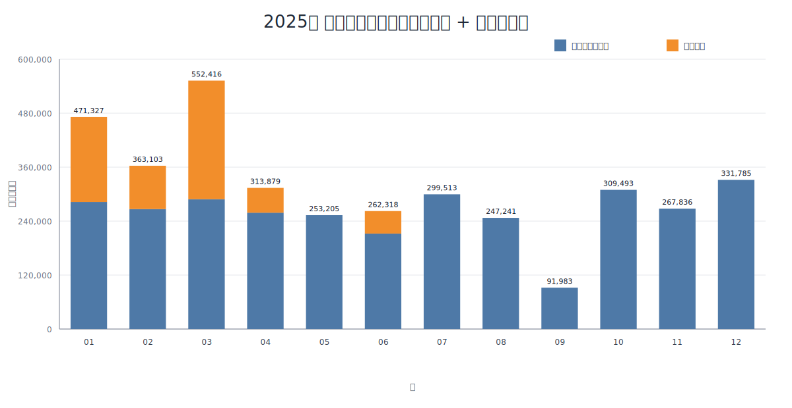

# 家計レポート 2025

- 生成日時(UTC): `2026-02-17T13:13:31+00:00`
- 月次支出入: `hokurikuBank` ベース
- 支出ドライバー: `カード支出 + 銀行直接支出(カード引落・家族間振替除外)`

## 月次 支出入・支出内訳（統合表）
| 月 | 入金(円) | 口座支出(円) | 収支(円) | 主要ドライバー(円) | 特別支出(円) | 分析支出合計(円) |
|---|---:|---:|---:|---:|---:|---:|
| 2025-01 | 440,000 | 357,504 | 82,496 | 327,134 | 0 | 327,134 |
| 2025-02 | 273,131 | 734,290 | -461,159 | 432,099 | 241,250 | 673,349 |
| 2025-03 | 2,480,000 | 2,059,071 | 420,929 | 510,215 | 2,137,590 | 2,647,805 |
| 2025-04 | 240,000 | 1,966,160 | -1,726,160 | 501,203 | 494,520 | 995,723 |
| 2025-05 | 660,000 | 570,296 | 89,704 | 343,014 | 0 | 343,014 |
| 2025-06 | 1,240,000 | 250,498 | 989,502 | 221,109 | 0 | 221,109 |
| 2025-07 | 220,000 | 286,746 | -66,746 | 294,620 | 0 | 294,620 |
| 2025-08 | 660,802 | 411,637 | 249,165 | 230,074 | 132,520 | 362,594 |
| 2025-09 | 440,000 | 327,015 | 112,985 | 292,803 | 78,000 | 370,803 |
| 2025-10 | 440,000 | 613,370 | -173,370 | 339,113 | 267,900 | 607,013 |
| 2025-11 | 440,000 | 377,579 | 62,421 | 367,890 | 0 | 367,890 |
| 2025-12 | 1,980,000 | 526,771 | 1,453,229 | 309,671 | 200,830 | 510,501 |
| 合計 | 9,513,933 | 8,480,937 | 1,032,996 | 4,168,945 | 3,552,610 | 7,721,555 |

## 月次 支出積み上げグラフ（主要ドライバー + 特別支出）

## 主要支出ドライバー分類
| 分類 | 金額(円) | 構成比 | 主な内容 |
|---|---:|---:|---|
| その他 | 2,133,904 | 27.6% | (摘要空欄), スイング, リユクストレ-ニング |
| 住居・不動産関連 | 1,325,490 | 17.2% | ニツシンカンザイ(カ, ホクリクデンリヨク(デンキリヨウ), カ)エムジエイホ-ムエイブルヒコネエキマエテン |
| EC・大型買物 | 881,910 | 11.4% | AMAZON.CO.JP, サンキュ-, ニトリ |
| 食費・日用品 | 866,050 | 11.2% | ペイペイ*アルビス, バロ-(ス-パ-), ペイペイ アルビス |
| 保険 | 836,622 | 10.8% | SMBC(プルデンシヤ, アイオイニツセイドウワ |
| 交通・車 | 821,919 | 10.6% | ジドウキ, オ-トガレ-ジヨシダ タ, ENEOS‐SS |
| 税金・公金 | 422,810 | 5.5% | PE ペイジエント, コテイシサン 1キ, コテイシサン 4キ |
| 教育 | 340,910 | 4.4% | SMBC(シガダイガク, ホウセイダイガクケンテイリヨウ, シガダイガク |
| 通信・サブスク | 91,940 | 1.2% | メルスプラン月額費用, ネットフリックス, NETFLIX.COM |
| 合計 | 7,721,555 | 100.0% |  |

## 特別支出分類
| 分類 | 金額(円) | 件数 |
|---|---:|---:|
| 住宅・不動産関連 | 711,316 | 3 |
| 保険 | 648,870 | 3 |
| 自動車関連 | 578,000 | 4 |
| 要確認(摘要空欄) | 555,550 | 1 |
| 大型購入 | 450,724 | 4 |
| 教育 | 267,900 | 1 |
| 税金・公金 | 241,250 | 1 |
| その他特別 | 99,000 | 1 |
| 合計 | 3,552,610 | 18 |

## 特別支出 上位10件
| 日付 | ソース | 内容 | 金額(円) |
|---|---|---|---:|
| 2025-03-07 | bank | (摘要空欄) | 555,550 |
| 2025-03-17 | bank | ニツシンカンザイ(カ | 387,546 |
| 2025-04-28 | bank | SMBC(プルデンシヤ | 315,520 |
| 2025-10-27 | bank | SMBC(シガダイガク | 267,900 |
| 2025-03-10 | bank | ジドウキ | 250,000 |
| 2025-02-13 | bank | PE ペイジエント | 241,250 |
| 2025-03-23 | bank | カ)エムジエイホ-ムエイブルヒコネエキマエテン | 228,070 |
| 2025-12-29 | bank | SMBC(プルデンシヤ | 200,830 |
| 2025-03-10 | bank | ジドウキ | 170,000 |
| 2025-03-08 | card | サンキュ- | 136,236 |

## 支出改善アクション（優先5項目）
### 1) やめる候補（停止で効果が出るもの）
| 候補 | 年間金額(円) | 発生回数 | 発生月数 | 推奨アクション |
|---|---:|---:|---:|---|
| リユクストレーニング | 149,600 | 13 | 10 | 利用頻度が低い場合は停止 |
| メルスプラン | 73,700 | 29 | 12 | 代替手段があれば停止 |
| NETFLIX | 14,280 | 12 | 11 | 視聴頻度が低ければ停止 |
| FAMILY CLUB | 3,960 | 12 | 12 | 必要性が低ければ停止 |
| スイング | 240,000 | 12 | 12 | 必須でなければ停止 |
| 合計 | 481,540 |  |  |  |

### 2) 減らす候補（停止せず圧縮するもの）
| 候補 | 現状金額(円) | 削減率 | 削減見込み(円/年) | 実行ルール |
|---|---:|---:|---:|---|
| Amazon系 | 535,818 | 20% | 107,163 | 月次上限を設定（例: 3万円） |
| 食費・日用品（主要店） | 684,940 | 5% | 34,247 | 週次予算を固定 |
| 保険（プルデン/あいおい） | 836,622 | 10% | 83,662 | 保障重複を見直す |
| 車関連 | 798,059 | 5% | 39,902 | 給油・整備の見積比較 |
| 合計 |  |  | 264,974 |  |

### 3) 特別支出の再発防止
- 特別支出は `年間 3,552,610円`。 毎月 `約296,050円` を特別費口座へ先取り積立。
- 5万円超の支出は「48時間保留 + 家族合意」を運用ルール化。

### 4) 参考（カテゴリ規模）
- EC・大型買物: `881,910円/年`（Amazon系 `535,818円/年`）
- 食費・日用品: `866,050円/年`
- 保険: `836,622円/年`
- 交通・車: `821,919円/年`
